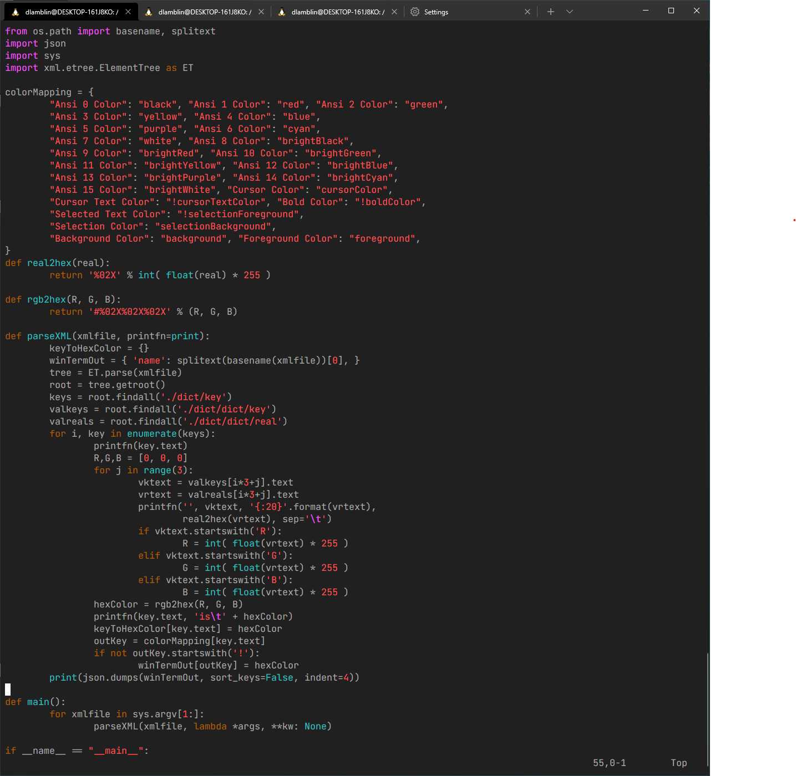
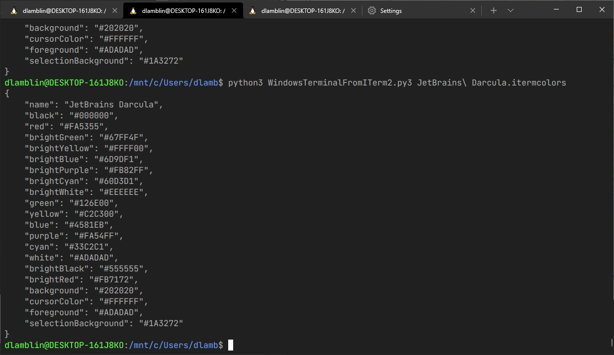
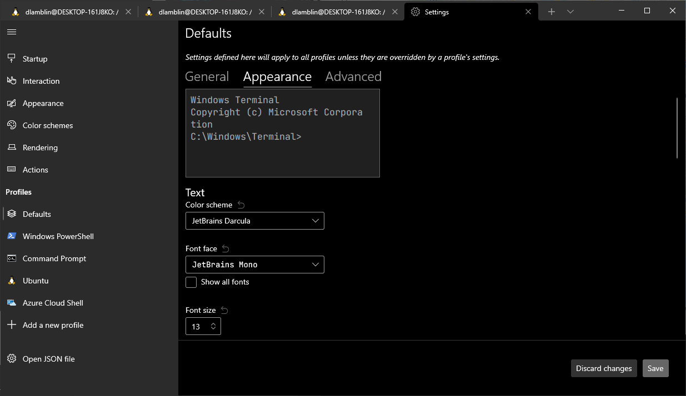
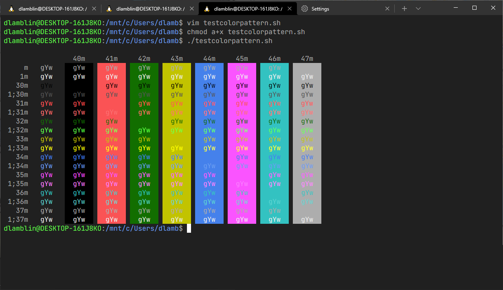

# Converting iTerm color settings to Windows Terminal color settings.

iTerm and iTerm2 have a number of popular preset color themes, as does Windows
Terminal.  However there's not too much overlap between the two. If you have a
preference available in iTerm and would like to use that in Windows Terminal
this Python script can convert it for you.

Specifically I was into the IntelliJ IDEA color theme Darcula. I had
previously like Solarized, but started finding the former easier over all to
read. Additionally I found that it could be used with the free font from
JetBrains, called JetBrains Mono, thus completing the interoperable look
between the IDE and the Terminal (I am not a fan of the built in Terminal, it
doesn't seem to be entirely xterm color compatible (it seems to have vt220
down). And it turns out though there's an extensive color theme called Dracula
its not the same as Darcula, in contrast.

Normally one would just manually copy the 16 to 24 colors needed to setup
another theme, but oddly the iTerm2 format doesn't use RGB values in 0-255 nor
HEX format. So a conversion was in order. Searching for other attempts did
find several that used Powershell to half-prepare it, but oddly my version of
Windows 10 didn't want to run Powershell scripts and I didn't feel it
necessary to dig into why when I already had Python installed.

I hope you also find this script useful.

### Get the script into your machine along with an iterm xml file of choice

### Run the script with Python on that file

### Open the JSON file of settings and add the output color theme into the array of themes.

### Test your colors in Windows Terminal

